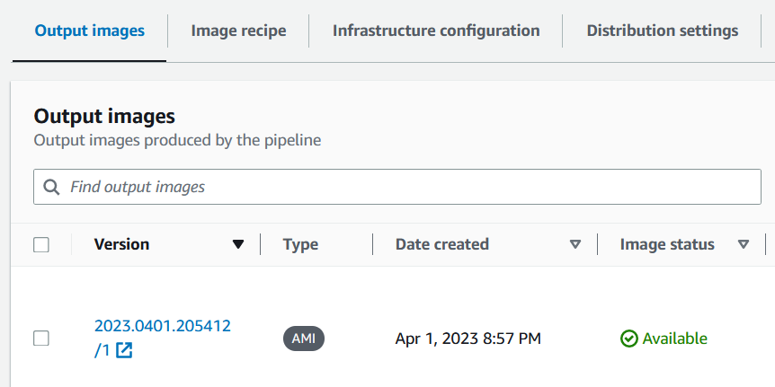
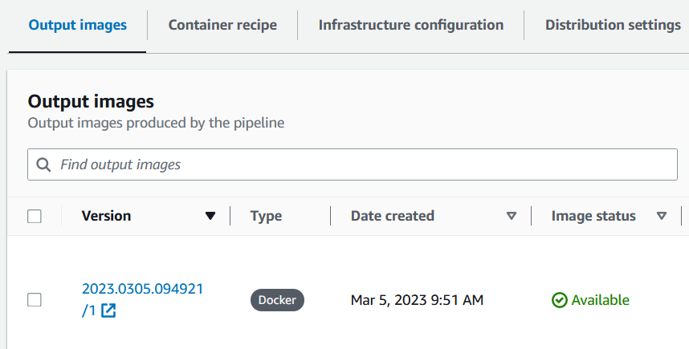
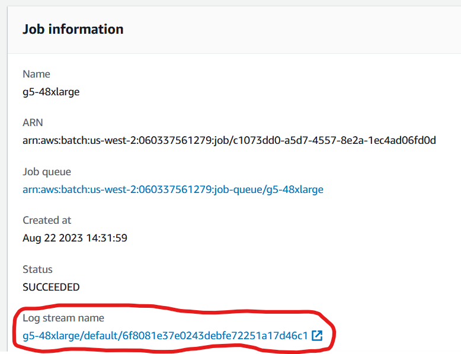
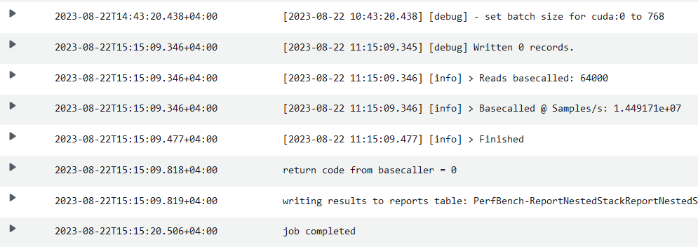
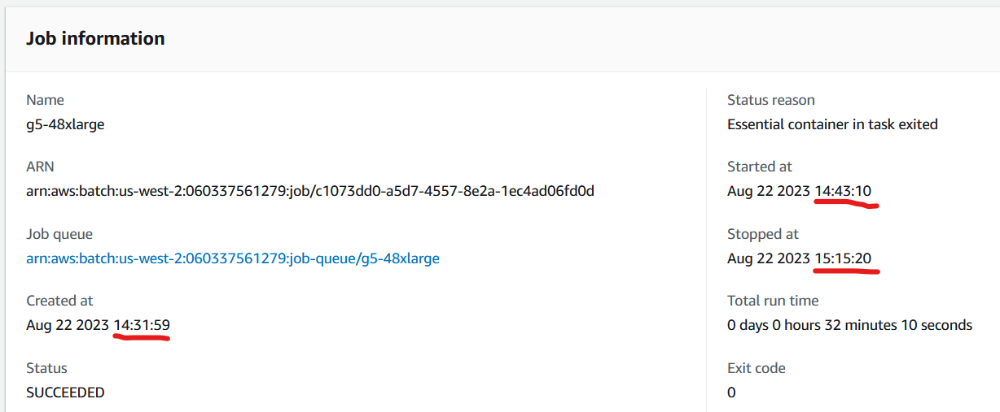
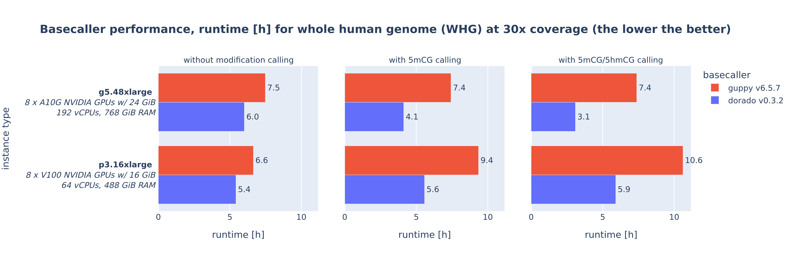
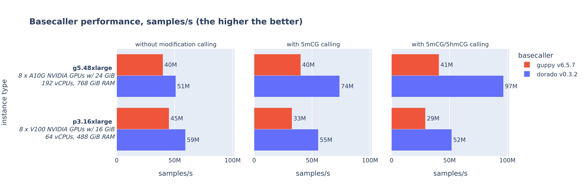

# Performance Test Oxford Nanopore Technologies Basecaller

# Disclaimers

### Third Party Packages
This package depends on and may incorporate or retrieve a number of third-party
software packages (such as open source packages) at install-time or build-time
or run-time ("External Dependencies"). The External Dependencies are subject to
license terms that you must accept in order to use this package. If you do not
accept all of the applicable license terms, you should not use this package. We
recommend that you consult your company’s open source approval policy before
proceeding.

Provided below is a list of External Dependencies and the applicable license
identification as indicated by the documentation associated with the External
Dependencies as of Amazon's most recent review.

THIS INFORMATION IS PROVIDED FOR CONVENIENCE ONLY. AMAZON DOES NOT PROMISE THAT
THE LIST OR THE APPLICABLE TERMS AND CONDITIONS ARE COMPLETE, ACCURATE, OR
UP-TO-DATE, AND AMAZON WILL HAVE NO LIABILITY FOR ANY INACCURACIES. YOU SHOULD
CONSULT THE DOWNLOAD SITES FOR THE EXTERNAL DEPENDENCIES FOR THE MOST COMPLETE
AND UP-TO-DATE LICENSING INFORMATION.

YOUR USE OF THE EXTERNAL DEPENDENCIES IS AT YOUR SOLE RISK. IN NO EVENT WILL
AMAZON BE LIABLE FOR ANY DAMAGES, INCLUDING WITHOUT LIMITATION ANY DIRECT,
INDIRECT, CONSEQUENTIAL, SPECIAL, INCIDENTAL, OR PUNITIVE DAMAGES (INCLUDING
FOR ANY LOSS OF GOODWILL, BUSINESS INTERRUPTION, LOST PROFITS OR DATA, OR
COMPUTER FAILURE OR MALFUNCTION) ARISING FROM OR RELATING TO THE EXTERNAL
DEPENDENCIES, HOWEVER CAUSED AND REGARDLESS OF THE THEORY OF LIABILITY, EVEN
IF AMAZON HAS BEEN ADVISED OF THE POSSIBILITY OF SUCH DAMAGES. THESE LIMITATIONS
AND DISCLAIMERS APPLY EXCEPT TO THE EXTENT PROHIBITED BY APPLICABLE LAW.

 * __NVIDIA Container Runtime (nvidia/cuda)__, repository: https://github.com/NVIDIA/nvidia-docker, 
   license: https://github.com/NVIDIA/nvidia-docker/blob/main/LICENSE - Apache License Version 2.0, January 2004
 * __Dorado high-performance basecaller for Oxford Nanopore reads__, repository: https://github.com/nanoporetech/dorado/, 
   license: https://github.com/nanoporetech/dorado/blob/master/LICENCE.txt - Oxford Nanopore Technologies PLC. Public License Version 1.0
 * __Guppy accelerated basecalling for Nanopore data__, source: https://community.nanoporetech.com/docs/prepare/library_prep_protocols/Guppy-protocol/v/gpb_2003_v1_revax_14dec2018/linux-guppy

### General

AWS does not represent or warrant that this AWS Content is production ready.  You are 
responsible for making your own independent assessment of the information, guidance, code and 
other AWS Content provided by AWS, which may include you performing your own independent testing, 
securing, and optimizing. You should take independent measures to ensure that you comply with 
your own specific quality control practices and standards, and to ensure that you comply with 
the local rules, laws, regulations, licenses and terms that apply to you and your content.  If 
you are in a regulated industry, you should take extra care to ensure that your use of this AWS 
Content, in combination with your own content, complies with applicable regulations (for example, 
the Health Insurance Portability and Accountability Act of 1996). AWS does not make any representations, 
warranties or guarantees that this AWS Content will result in a particular outcome or result. 

# Introduction

This project was developed to produce the results presented in the blog post 
[Benchmarking the Oxford Nanopore Technologies basecallers on AWS](https://aws.amazon.com/blogs/hpc/benchmarking-the-oxford-nanopore-technologies-basecallers-on-aws/).

This project stands up an environment for running performance benchmark tests for the [Oxford Nanopore Technologies](https://nanoporetech.com)
basecallers guppy and dorado.

Guppy and dorado make extensive use of GPUs. The purpose of this performance benchmark solution is to establish run time 
and cost for various AWS EC2 instance types. The performance test results help customers with Oxford Nanopore sequencer
instruments to select appropriate instance types for running basecalling on the AWS cloud.

This project deploys the following architecture (for a discussion please see the blog post linked above).


# Table of contents

1. [Preparing the AWS account for deployment](#preparing-the-aws-account-for-deployment)
2. [Deploying the project](#deploying-the-project)
3. [Validating deployment completion](#validating-deployment-completion)
4. [Running the performance benchmark tests](#running-the-performance-benchmark-tests)
5. [Monitoring the execution of the running benchmark tests](#monitoring-the-execution-of-the-running-benchmark-tests)
6. [Generating the results report](#generating-the-results-report)
7. [Cleaning up](#cleaning-up)
8. [Security](#security)
9. [License](#license)


## Preparing the AWS account for deployment

All commands shown below are executed in a [Cloud9 environment](https://us-west-2.console.aws.amazon.com/cloud9control/home?region=us-west-2#/) 
with Ubuntu. When working with the Cloud9 environment, it is required to expand the disk to 70 GB. Please follow the 
instructions outlined in the Cloud9 user guide: [Resize an Amazon EBS volume that an environment uses](https://docs.aws.amazon.com/cloud9/latest/user-guide/move-environment.html#move-environment-resize) 

This project performs a fully automated deployment of the performance benchmarking environment. The project utilizes 
the AWS Cloud Development Toolkit version 2 (CDK v2) for Python.

This project has been tested in the us-west-2 (Oregon) region. All instructions below assume a deployment in us-west-2.

The performance benchmarks are executed on various AWS EC2 instance types with GPUs. For running multiple instances in
parallel, it is recommended to increase quotas for service "Amazon Elastic Compute Cloud (Amazon EC2)" to 
the following values:
- _All G and VT Spot Instance Requests_: 850
- _Running On-Demand G and VT instances_: 850
- _All P4, P3 and P2 Spot Instance Requests_: 400
- _Running On-Demand P instances_: 400

The deployment requires the NVIDIA CUDA base container from the public docker repository in your private ECR repository.
This container is required for the build of the guppy and dorado container.
Run the commands below to copy the container. Make sure you run the commands with AWS credentials for the us-west-2 
region.
```shell
#cuda_container="nvidia/cuda:12.3.2-runtime-ubuntu20.04"
cuda_container="nvidia/cuda:12.3.0-runtime-ubuntu20.04"
aws ecr create-repository --repository-name 'nvidia/cuda' --region us-west-2
docker login
docker pull "$cuda_container"
aws_account_id=$(aws sts get-caller-identity --query 'Account' --output text)
docker tag "$cuda_container" "$aws_account_id.dkr.ecr.us-west-2.amazonaws.com/$cuda_container"
aws ecr get-login-password --region us-west-2 | docker login --username AWS --password-stdin "$aws_account_id.dkr.ecr.us-west-2.amazonaws.com"
docker push "$aws_account_id.dkr.ecr.us-west-2.amazonaws.com/$cuda_container"
```

## Deploying the project

Activate the Python virtual environment and install all required libraries:
```shell
python -m venv .venv
. ./.venv/bin/activate
python -m ensurepip --upgrade
python -m pip install --upgrade pip
python -m pip install --upgrade virtualenv
pip install -r requirements.txt
```

Bootstrap the CDK environment. If you work with CDK regularly, you may have done this earlier.  
```shell
cdk bootstrap
```

Run the following command to deploy the project.
```shell
cdk deploy --all
```

The project consists of multiple stacks. If you don't wish to manually confirm the deployment of each stack and the 
security settings, you can run deployment with the following parameters: `--require-approval never` saves you from 
confirming the security settings and `--no-prompts` removes the manual confirmation before deployment of each stack.
```shell
cdk deploy --all --require-approval never --no-prompts
```

## Validating deployment completion

After the CDK deployment of the infrastructure, a few automated steps are triggered. A base AMI image and a docker 
container with the guppy and dorado tools are being build. The test data is being downloaded. The instructions
below help to check when these steps have been completed.

1. **CDK deployment:** The CDK deployment takes around 35 minutes. Once completed, CDK will display the following message on the command line.
```shell
PerfBench: deploying... [1/2]
PerfBench: creating CloudFormation changeset...

 ✅  PerfBench

✨  Deployment time: 1028.09s

Outputs:

<details removed for brevity> 

✨  Total time: 1047.02s

...
PerfBench-Downloader: deploying... [2/2]
PerfBench-Downloader: creating CloudFormation changeset...

 ✅  PerfBench-Downloader

✨  Deployment time: 163s

<details removed for brevity>

✨  Total time: 181.93s
```

2. **Base AMI image and docker container builds:** The base AMI image and docker container builds complete around 25 minutes 
after the CDK deployment has completed. To check the status, navigate to the [EC2 Image Builder console](https://us-west-2.console.aws.amazon.com/imagebuilder/home?region=us-west-2#/viewPipelines).
Select the `ONT base AMI pipeline`. In the _Output images_ section you should see an image version with _Image status_ "Available":



Select the `ONT basecaller container pipeline` and check the _Output images_ section for an image version with 
_Image status_ "Available":



3. **Test data download:** Downloading and converting the test data from FAST5 to POD5 format takes around 7.5 hours. 

CDK deploys an EC2 instance (shown as "downloader" in the architecture diagram above) that 
automatically downloads the [CliveOME 5mC dataset](https://labs.epi2me.io/cliveome_5mc_cfdna_celldna/)
data set as test data from an S3 bucket maintained by Oxford Nanopore. The data set has total size of 745 GiB.
After the download, the downloader instance will trigger the deletion of the downloader CDK stack. This is done to avoid 
cost from an idle EC2 instance.

To check progress on the download open the [CloudWatch Logs console](https://us-west-2.console.aws.amazon.com/cloudwatch/home?region=us-west-2#logsV2:log-groups/log-group/$252Faws$252FPerfBench$252Fdownloader) 
and check the `/aws/PerfBench/downloader` log group. The download is complete when you see the following lines at the 
end of the log:

```
----- check download and conversion results -----
584 FAST5 files downloaded and converted to 584 POD5 files.
OK: Download and conversion successful.
----- delete downloader CloudFormation stack -----
-----
----- end UserData script -----
```

## Running the performance benchmark tests

To start the benchmark tests run the following command:
```shell
. ./.venv/bin/activate
python ./create_jobs/create_jobs.py
```
This command runs a Python script that will submit a number of AWS Batch jobs to be run on EC2
instances. The test data set is split across the number of GPUs and one AWS Batch job per GPU is generated. Jobs are
generated for running the `dorado` and the `guppy` basecallers. When executed successfully, you will see a 
number of job IDs reported back:
```shell
Generating AWS Batch jobs ...
instance type: p3.16xlarge, tags: dorado, modified bases 5mCG & 5hmCG, file list: /fsx/pod5-subsets/wgs_subset_128_files_8_0.lst, job ID: f1950d6e-ce5d-4eab-baed-15988acbc78e
instance type: p3.16xlarge, tags: dorado, modified bases 5mCG & 5hmCG, file list: /fsx/pod5-subsets/wgs_subset_128_files_8_1.lst, job ID: 61c39e72-a38c-46f5-aa0b-af74ee5e160e
instance type: p3.16xlarge, tags: dorado, modified bases 5mCG & 5hmCG, file list: /fsx/pod5-subsets/wgs_subset_128_files_8_2.lst, job ID: 629a09d5-191e-4f29-825b-cbbeed414066
instance type: p3.16xlarge, tags: dorado, modified bases 5mCG & 5hmCG, file list: /fsx/pod5-subsets/wgs_subset_128_files_8_3.lst, job ID: 4c96df78-3bba-4905-9ffb-4ee9bfb3d30c
instance type: p3.16xlarge, tags: dorado, modified bases 5mCG & 5hmCG, file list: /fsx/pod5-subsets/wgs_subset_128_files_8_4.lst, job ID: adfaab0f-1c13-4864-8f5b-be26418c8591
instance type: p3.16xlarge, tags: dorado, modified bases 5mCG & 5hmCG, file list: /fsx/pod5-subsets/wgs_subset_128_files_8_5.lst, job ID: efd97b71-053f-4150-a43d-1f9ddcf1b669
instance type: p3.16xlarge, tags: dorado, modified bases 5mCG & 5hmCG, file list: /fsx/pod5-subsets/wgs_subset_128_files_8_6.lst, job ID: de615adf-496b-4c53-a8c4-e1fe599e816b
instance type: p3.16xlarge, tags: dorado, modified bases 5mCG & 5hmCG, file list: /fsx/pod5-subsets/wgs_subset_128_files_8_7.lst, job ID: af6424bb-b43c-4dd9-9290-4a2cf04d4120
Done. Check the status of the jobs in the AWS Batch console.
```
To run on multiple EC2 instance types and different sets of `dorado` and `guppy` configurations, please adjust `./create_jobs/create_jobs.py`
to your requirements.

## Monitoring the execution of the running benchmark tests

The performance benchmark tests are tasks that, depending on the selected instance type, can run between 30 minutes and 
several hours. The following steps provide guidance for how to check jobs have been submitted successfully and are 
running.

1. **check submitted jobs are visible in AWS Batch:** after starting the benchmark tests as described above, navigate to 
the [AWS Batch console](https://us-west-2.console.aws.amazon.com/batch/home?region=us-west-2). Scroll down to job queue
"g5-48xlarge". Immediately after submitting the benchmark test jobs you will see the jobs with status "RUNNABLE".


2. **check EC2 instances are started:** once jobs have arrived, AWS Batch will automatically start the EC2 instances 
required to run the benchmark tests. Navigate to the [EC2 Auto Scaling Groups console](https://us-west-2.console.aws.amazon.com/ec2/home?region=us-west-2#AutoScalingGroups:).
Select the Auto Scaling group (ASG) that contains the job-queue name (e.g. \*g5-48xlarge\*). In column "Instances" you 
should see that one or more instances have been launched.


Please note, if you are submitting jobs for EC2 instance types that are in high demand, you may see the following
message under the "Activity" tab of the ASG:

*"Could not launch On-Demand Instances. InsufficientInstanceCapacity - We currently do not have sufficient p3dn.24xlarge capacity in the Availability Zone you requested (us-west-2c). Our system will be working on provisioning additional capacity."*

AWS Batch will automatically retry in the background to launch the required instance type and execute the job once 
instances become available.

3. **check AWS Batch job enters "RUNNING" state:** Navigate to the [AWS Batch jobs console](https://us-west-2.console.aws.amazon.com/batch/home?region=us-west-2#jobs)
and select the "g5-48xlarge" job queue. You will see "RUNNING" in the Status column. Please note, it takes around 10 - 13 
minutes from submitting the jobs until AWS Batch shows the "RUNNING" state. During this time the Auto Scaling group 
launches EC2 instances and the basecaller container image (several GB in size!) is downloaded from the Elastic Container 
Registry (ECR) and started.


4. **check job log outputs:** Once a job has entered the "RUNNING" state all commandline outputs from the basecallers are 
redirected to CloudWatch Logs. To see the log output, select a running job in the [AWS Batch Jobs console](https://us-west-2.console.aws.amazon.com/batch/home?region=us-west-2#jobs).
In the "Job information" section select the log stream URL.



You will be redirected to the CloudWatch logs event console where you can inspect the log messages.



5. **Check job has finished:** select a job in the [AWS Batch Jobs console](https://us-west-2.console.aws.amazon.com/batch/home?region=us-west-2#jobs).
The completion of a job is reported in the "Job information" section. Please note that it takes around 10 - 12 minutes 
for a job to start and another 30 minutes to several hours (depending on instance type) to complete.



## Generating the results report

Once the submitted AWS Batch jobs have completed, you can generate the results report by running:
```shell
. ./.venv/bin/activate
python ./results/results.py
```
After completion, you will find the following diagram and Excel files in the directory:
```shell
ONT_basecaller_performance_comparison.xlsx
ONT_basecaller_performance_runtime_whg_30x.png
ONT_basecaller_performance_samples_s.png
```





## Cleaning up

After concluding the benchmark tests all resources are destroyed by running the following command.

```shell
cdk destroy --all --require-approval never
```

## Security

See [CONTRIBUTING](CONTRIBUTING.md#security-issue-notifications) for more information.

## License

This library is licensed under the MIT-0 License. See the LICENSE file.
